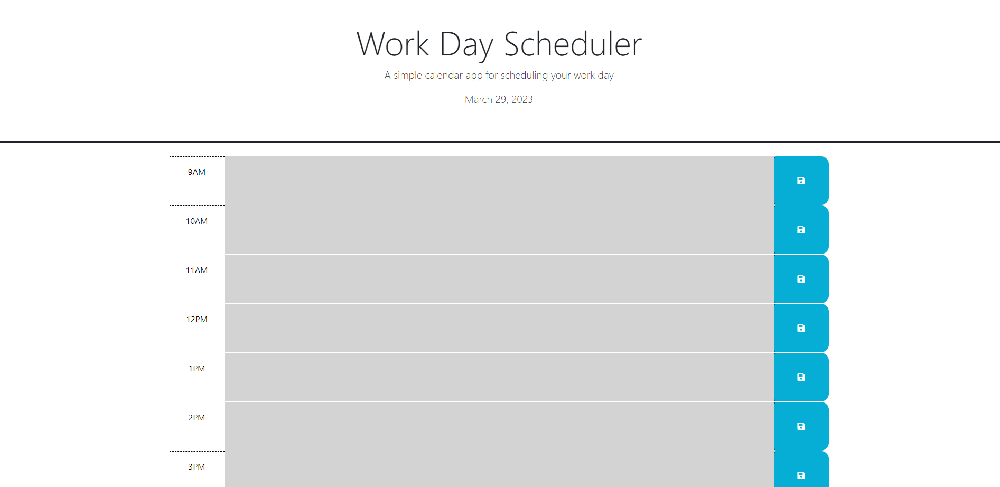

# Work Day Scheduler

## Description

A simple calendar application that allows users to save events for each hour of the day. This app runs in the browser and features dynamically updated HTML and CSS powered by jQuery. The Day.js library is used to work with date and time.

## User Story

As an employee with a busy schedule, I want to add important events to a daily planner, so that I can manage my time effectively.

## Acceptance Criteria

- The current day is displayed at the top of the calendar.
- Timeblocks for standard business hours are presented.
- Each timeblock is color-coded to indicate whether it is in the past, present, or future.
- Clicking into a timeblock allows users to enter an event.
- Clicking the save button for that timeblock saves the text for that event in local storage.
- Saved events persist when the page is refreshed.

## Deployment

The application is deployed at [live URL](ishaval.github.io/challenge-5/).

## Installation

To run the application locally:

1. Clone the repository.
2. Open `index.html` in your preferred web browser.

## Technologies Used

- HTML
- CSS
- JavaScript
- jQuery
- Day.js

## License

This project is licensed under the MIT License.
